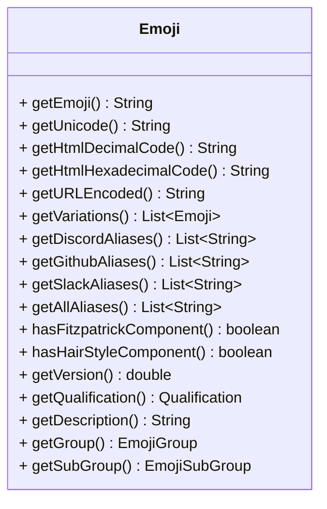

<a name="startReadme"></a>


# Java Emoji (JEmoji)

JEmoji is a lightweight and fast emoji library for Java with a complete list of all emojis from the unicode consortium.

## ❓ Why another emoji library?

While several other emoji libraries for Java exist, most of them are incomplete or outdated. JEmoji, on the other
hand, offers a complete list of all emojis from the Unicode Consortium, which can be generated quickly and easily with
just one task. This is a major advantage over other libraries that may be no longer maintained or require extensive
manual work
to update their emoji lists.

In addition, the data is fetched from multiple sources to ensure that information about each emoji is enhanced as much
as possible.

### Fetched sources:

- [unicode.org](https://unicode.org/Public/emoji/latest/emoji-test.txt) for all unicode emojis
- [EmojiTerra](https://emojiterra.com/list/) for additional information about emojis like aliases
- [discord-emoji by Emzi0767](https://gitlab.emzi0767.dev/Emzi0767/discord-emoji) for additional information about
  emojis for Discord

## 📦 Installation

Replace the ``VERSION``  with the latest version shown at the [start](#startReadme) of the README

### Gradle Kotlin DSL

```kotlin
implementation("net.fellbaum:jemoji:VERSION")
```

### Maven

```xml

<dependency>
    <groupId>net.fellbaum</groupId>
    <artifactId>jemoji</artifactId>
    <version>VERSION</version>
</dependency>
```

## 📝 Usage

### EmojiManager

#### Get all emojis

```java
Set<Emoji> emojis=EmojiManager.getAllEmojis();
```

#### Get emoji by unicode string

```java
Optional<Emoji> emoji=EmojiManager.getEmoji("😀");
```

#### Get emoji by alias

```java
Optional<Emoji> emoji=EmojiManager.getByAlias("smile");
// or
Optional<Emoji> emoji=EmojiManager.getByAlias(":smile:");
```

#### Get all emojis by group (general category of emojis)

```java
Set<Emoji> emojis=EmojiManager.getAllEmojisByGroup(EmojiGroup.SMILEYS_AND_EMOTION);
```

#### Get all emojis by subgroup (more specific set of emojis)

```java
Set<Emoji> emojis=EmojiManager.getAllEmojisBySubGroup(EmojiSubGroup.ANIMAL_BIRD);
```

#### Check if the provided string is an emoji

```java
boolean isEmoji=EmojiManager.isEmoji("😀");
```

#### Check if the provided string contains an emoji

```java
boolean containsEmoji=EmojiManager.containsEmoji("Hello 😀 World");
```

#### Extract all emojis from a string in the order they appear

```java 
List<Emoji> emojis=EmojiManager.extractEmojisInOrder("Hello 😀 World 👍"); // [😀, 👍]
```

#### Extract all emojis from a string in the order they appear, with their found index

```java 
List<IndexedEmoji> emojis=EmojiManager.extractEmojisInOrderWithIndex("Hello 😀 World 👍");
emojis.get(0).getCharIndex() // Prints "6"
emojis.get(0).getCodePointIndex() // Prints "6"
emojis.get(1).getCharIndex() // Prints "15"
emojis.get(1).getCodePointIndex() // Prints "14"
emojis.get(0).getEmoji() // Gets the Emoji object
```

#### Remove all emojis from a string

```java
String text=EmojiManager.removeAllEmojis("Hello 😀 World 👍"); // "Hello  World "
```

#### Remove specific emojis from a string

```java
String text=EmojiManager.removeEmojis("Hello 😀 World 👍",EmojiManager.getEmoji("😀").orElseThrow(RuntimeException::new)); // "Hello  World 👍"
```

#### Replace all emojis in a string

```java
String text=EmojiManager.replaceAllEmojis("Hello 😀 World 👍","<an emoji was here>"); // "Hello <an emoji was here> World <an emoji was here>"
//or more control of the replacement with a Function that provides the emoji and wants a string as return value
String text=EmojiManager.replaceAllEmojis("Hello 😀 World 👍",Emoji::getHtmlDecimalCode); // "Hello &#128512; World &#128077;"
```

#### Replace specific emojis in a string

```java
String text=EmojiManager.replaceEmojis("Hello 😀 World 👍","<an emoji was here>",EmojiManager.getEmoji("😀").orElseThrow(RuntimeException::new)); // "Hello <an emoji was here> World 👍"
```

### Emoji Object



## 🚀 Benchmarks

On every push on the master branch,
a benchmark will be executed and automatically deployed to this
projects [GitHub pages](https://felldo.github.io/JEmoji/dev/bench/).
These benchmarks are executed on GitHub runners and therefore are not very accurate and can differ a bit since this
library measures benchmarks in single digit milliseconds range or even below.
They are generally okay to measure large differences if something bad got pushed but are not as reliable as the results
of benchmark table below which are always executed on the specified specs.

| **Benchmark**                                  | **Mode** | **Cnt** | **Score**** | **Error** | **Units** |
|------------------------------------------------|----------|---------|-------------|-----------|-----------|
| getByAlias -> :+1:                             | avgt     | 10      | 59,509      | ± 0,608   | ns/op     |
| getByAlias -> nope                             | avgt     | 10      | 72,004      | ± 0,546   | ns/op     |
| containsEmoji                                  | avgt     | 10      | 1,403       | ± 0,004   | ms/op     |
| extractEmojisInOrder                           | avgt     | 10      | 1,382       | ± 0,013   | ms/op     |
| extractEmojisInOrderOnlyEmojisLengthDescending | avgt     | 10      | 6,013       | ± 0,022   | ms/op     |
| extractEmojisInOrderOnlyEmojisRandomOrder      | avgt     | 10      | 6,614       | ± 0,045   | ms/op     |
| extractEmojisInOrderWithIndex                  | avgt     | 10      | 1,814       | ± 0,002   | ms/op     |
| removeAllEmojis                                | avgt     | 10      | 2,264       | ± 0,370   | ms/op     |
| replaceAllEmojis                               | avgt     | 10      | 2,517       | ± 0,020   | ms/op     |
| replaceAllEmojisFunction                       | avgt     | 10      | 2,502       | ± 0,023   | ms/op     |

<details>

<summary>Click to see the benchmark details</summary>

CPU:  Intel® Core™ i7-13700K

VM version: JDK 1.8.0_372, OpenJDK 64-Bit Server VM, 25.372-b07

Blackhole mode: full + dont-inline hint (auto-detected, use -Djmh.blackhole.autoDetect=false to disable)

Warmup: 5 iterations, 10 s each

Measurement: 5 iterations, 10 s each

Timeout: 10 min per iteration

Threads: 1 thread, will synchronize iterations

Benchmark mode: Average time, time/op
</details>

** Score depends on many factors like text size and emoji count if used as an argument. For this benchmark relatively
large files were used. Click [Here](./lib/src/jmh/) to see the benchmark code and resources.

## 💾 Emoji JSON list Generation

The emoji list can be easily generated with the ``generateEmojis`` Gradle task. The generated list will be saved in the
``src/main/resources`` folder.