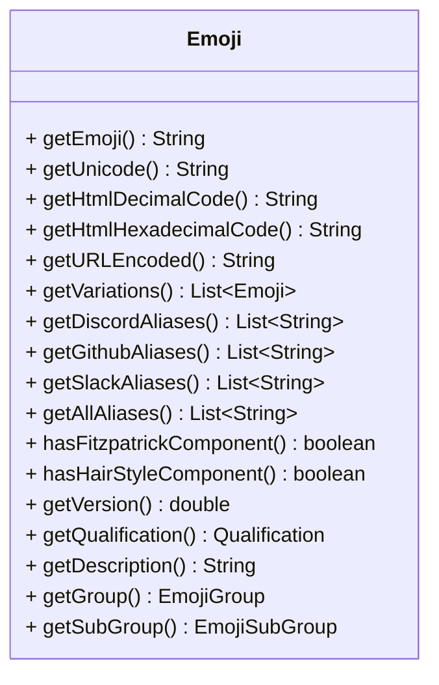

<a name="startReadme"></a>


# Java Emoji (JEmoji)

JEmoji is a lightweight and fast emoji library for Java with a complete list of all emojis from the unicode consortium. 

## ❓ Why another emoji library?

While several other emoji libraries for Java exist, most of them are incomplete or outdated. JEmoji, on the other
hand, offers a complete list of all emojis from the Unicode Consortium, which can be generated quickly and easily with
just one task. This is a major advantage over other libraries that may be no longer maintained or require extensive
manual work
to update their emoji lists.

In addition, the data is fetched from multiple sources to ensure that information about each emoji is enhanced as much
as possible.

### Fetched sources:

- [unicode.org](https://unicode.org/Public/emoji/latest/emoji-test.txt) for all unicode emojis
- [EmojiTerra](https://emojiterra.com/list/) for additional information about emojis like aliases
- [discord-emoji by Emzi0767](https://gitlab.emzi0767.dev/Emzi0767/discord-emoji) for additional information about
  emojis for Discord

## 📦 Installation

Replace the ``VERSION``  with the latest version shown at the [start](#startReadme) of the README

### Gradle Kotlin DSL

```kotlin
implementation("net.fellbaum:jemoji:VERSION")
```

### Maven

```xml
<dependency>
    <groupId>net.fellbaum</groupId>
    <artifactId>jemoji</artifactId>
    <version>VERSION</version>
</dependency>
```

## 📝 Usage

### EmojiManager

#### Get all emojis

```java
Set<Emoji> emojis=EmojiManager.getAllEmojis();
```

#### Get emoji by unicode string

```java
Optional<Emoji> emoji=EmojiManager.getEmoji("😀");
```

#### Get emoji by alias

```java
Optional<Emoji> emoji=EmojiManager.getByAlias("smile");
// or
        Optional<Emoji> emoji=EmojiManager.getByAlias(":smile:");
```

#### Check if the provided string is an emoji

```java
boolean isEmoji=EmojiManager.isEmoji("😀");
```

#### Check if the provided string contains an emoji

```java
boolean containsEmoji=EmojiManager.containsEmoji("Hello 😀 World");
```

#### Extract all emojis from a string in order they appear

```java 
Set<Emoji> emojis = EmojiManager.extractEmojisInOrder("Hello 😀 World 👍"); // [😀, 👍]
```

#### Remove all emojis from a string

```java
String text=EmojiManager.removeAllEmojis("Hello 😀 World 👍"); // "Hello  World "
```

#### Remove specific emojis from a string

```java
String text=EmojiManager.removeEmojis("Hello 😀 World 👍",Collections.singletonList("😀")); // "Hello  World 👍"
```

#### Replace emojis in a string

```java
String text=EmojiManager.replaceAllEmojis("Hello 😀 World 👍","<an emoji was here>"); // "Hello <an emoji was here> World <an emoji was here>"
```

#### Replace specific emojis in a string

```java
String text=EmojiManager.replaceEmojis("Hello 😀 World 👍","<an emoji was here>",Collections.singletonList("😀")); // "Hello <an emoji was here> World 👍"
```

### Emoji Object



## 🚀 Benchmarks
| **Benchmark**                                  | **Mode** | **Cnt** | **Score** | **Error** | **Units** |
|------------------------------------------------|----------|---------|-----------|-----------|-----------|
| containsEmoji                                  | avgt     | 10      | 4,820     | ± 0,051   | ms/op     |
| extractEmojisInOrder                           | avgt     | 10      | 4,841     | ± 0,579   | ms/op     |
| extractEmojisInOrderOnlyEmojisLengthDescending | avgt     | 10      | 8,967     | ± 0,054   | ms/op     |
| extractEmojisInOrderOnlyEmojisRandomOrder      | avgt     | 10      | 9,364     | ± 0,081   | ms/op     |
| removeAllEmojis                                | avgt     | 10      | 7,813     | ± 0,454   | ms/op     |
| replaceAllEmojis                               | avgt     | 10      | 7,213     | ± 0,043   | ms/op     |

<details>

<summary>Click to see the benchmark details</summary>

CPU:  Intel® Core™ i7-13700K

VM version: JDK 1.8.0_372, OpenJDK 64-Bit Server VM, 25.372-b07

Blackhole mode: full + dont-inline hint (auto-detected, use -Djmh.blackhole.autoDetect=false to disable)

Warmup: 5 iterations, 10 s each

Measurement: 5 iterations, 10 s each

Timeout: 10 min per iteration

Threads: 1 thread, will synchronize iterations

Benchmark mode: Average time, time/op
</details>

## 💾 Emoji JSON list Generation

The emoji list can be easily generated with the ``generateEmojis`` Gradle task. The generated list will be saved in the
``src/main/resources`` folder.