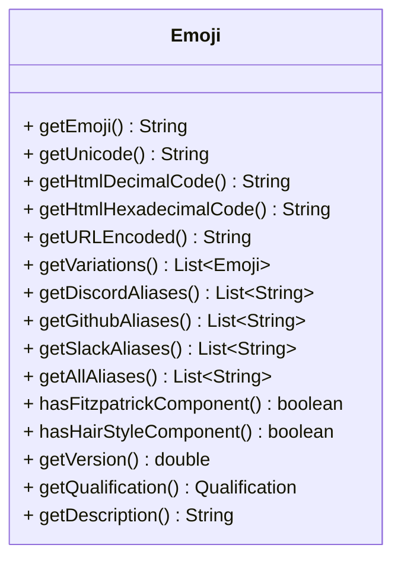

# Java Emoji (JEmoji)

JEmoji is an emoji library for Java with a complete list of all emojis from the unicode consortium.

## Why another emoji library?

There are already plenty of emoji libraries for Java but most of them are either incomplete or not up to date.
JEmoji has a complete list of all emojis of the unicode consortium.
This list can be generated at any time with executing only 1 task. This has a great advantage over other libraries, as
they are either not maintained anymore or require a lot of manual work to update their list of emojis.
In addition, multiple sources are fetched to provide additional information about the emojis.

### Fetched sources:

- [unicode.org](https://unicode.org/Public/emoji/latest/emoji-test.txt) for all unicode emojis
- [EmojiTerra](https://emojiterra.com/list/) for additional information about emojis like aliases
- [discord-emoji by Emzi0767](https://gitlab.emzi0767.dev/Emzi0767/discord-emoji) for additional information about emojis for Discord

## Install


## Usage

### EmojiManager

#### Get all emojis

```java
Set<Emoji> emojis = EmojiManager.getAllEmojis();
```

#### Get emoji by unicode string

```java
Optional<Emoji> emoji = EmojiManager.getEmoji("😀");
```

#### Get emoji by alias

```java
Optional<Emoji> emoji = EmojiManager.getByAlias("smile");
// or
Optional<Emoji> emoji = EmojiManager.getByAlias(":smile:");
```

#### Check if the provided string is an emoji

```java
boolean isEmoji = EmojiManager.isEmoji("😀");
```

#### Check if the provided string contains an emoji

```java
boolean containsEmoji = EmojiManager.containsEmoji("Hello 😀 World");
```

#### Extract all emojis from a string in order they appear

```java 
List<Emoji> emojis = EmojiManager.extractEmojisInOrder("Hello 😀 World 👍"); // [😀, 👍]
```

#### Remove all emojis from a string

```java
String text = EmojiManager.removeAllEmojis("Hello 😀 World ??"); // "Hello  World "
```

#### Remove specific emojis from a string

```java
String text = EmojiManager.removeEmojis("Hello 😀 World 👍", Collections.singletonList("😀")); // "Hello  World 👍"
```

#### Replace emojis in a string

```java
String text = EmojiManager.replaceAllEmojis("Hello 😀 World ??", "<an emoji was here>"); // "Hello <an emoji was here> World <an emoji was here>"
```

#### Replace specific emojis in a string

```java
String text = EmojiManager.replaceEmojis("Hello 😀 World 👍", "<an emoji was here>", Collections.singletonList("😀")); // "Hello <an emoji was here> World 👍"
```

### Emoji Object


