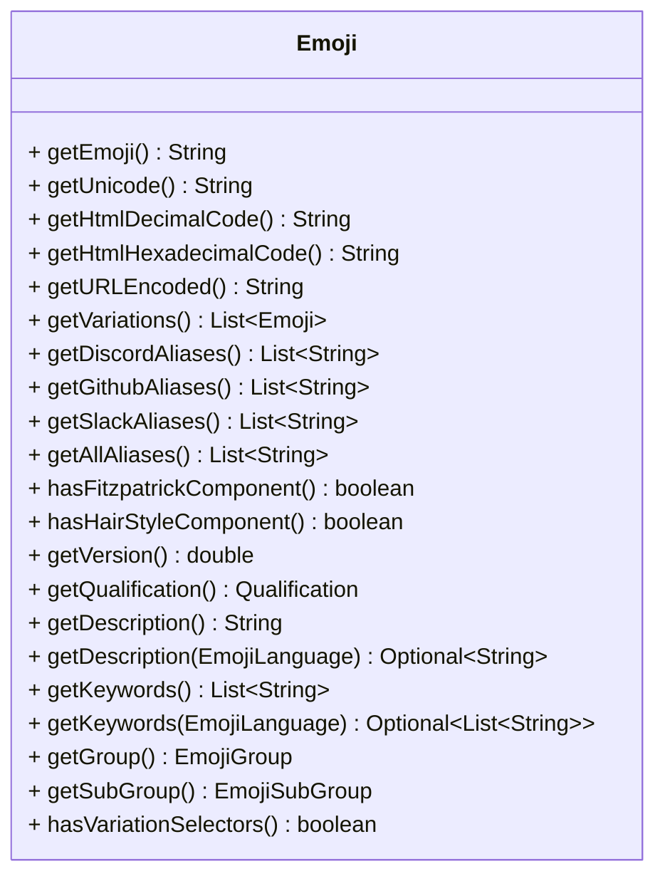

<a name="startReadme"></a>

<div align="center">

&replace=%241&style=for-the-badge&logo=unicode&label=Latest%20Unicode%20Emoji%20Version)


</div>

# Java Emoji (JEmoji)

JEmoji is a lightweight, fast and auto-generated emoji library for Java with a complete list of all emojis from the Unicode consortium.

With many utility methods and **type safe** direct access to Emojis,
JEmoji aims to improve your experience and development when working with Emojis.

## ⭐ Highlights
- Extract, replace and remove emojis from text.
- Ability to detect emoji in other representations than Unicode (HTML dec / hex, url encoded).
- Auto-generated type safe constant emojis are directly accessible `Emojis.THUMBS_UP` .
- Get emojis dynamically with `getEmoji`, `getByAlias`, `getByHtmlDecimal`,`getByHtmlHexadecimal`,`getByUrlEncoded`.
- One click to update the library to the newest Unicode consortium emoji specification.

## ❓ Why another emoji library?

While several other emoji libraries for Java exist, most of them are incomplete or outdated. JEmoji, on the other
hand, offers a complete list of all emojis from the Unicode Consortium, which can be generated quickly and easily with
just one task. This is a major advantage over other libraries that may be no longer maintained or require extensive
manual work
to update their emoji lists.

In addition, the data is fetched from multiple sources to ensure that information about each emoji is enhanced as much
as possible.

### Fetched sources:

- [unicode.org](https://unicode.org/Public/emoji/latest/emoji-test.txt) for all Unicode emojis
- [Discord](https://discord.com) custom script for fetching additional information about emojis for Discord
- [Slack](https://slack.com) custom script for fetching additional information about emojis for Slack

## 📦 Installation

Replace the ``VERSION``  with the latest version shown at the [start](#startReadme) of the README

### Gradle Kotlin DSL

```kotlin
implementation("net.fellbaum:jemoji:VERSION")
```

### Maven

```xml
<dependency>
    <groupId>net.fellbaum</groupId>
    <artifactId>jemoji</artifactId>
    <version>VERSION</version>
</dependency>
```

## 📜 `jemoji-language` module

The translation files for emoji descriptions and keywords are quite large (13 MB), 
while the main library is optimized for minimal size (~600 KB). 
To address this, a separate module, `jemoji-language`, 
has been introduced to provide translation files for over 160 languages as an optional dependency. 

The version is always kept in sync with the main module.

### Gradle Kotlin DSL

```kotlin
implementation("net.fellbaum:jemoji-language:VERSION")
```

### Maven

```xml
<dependency>
    <groupId>net.fellbaum</groupId>
    <artifactId>jemoji-language</artifactId>
    <version>VERSION</version>
</dependency>
```

## 📝 Usage

### Emojis

#### Access any emoji directly by a constant
```java
//Returns an Emoji instance
Emojis.THUMBS_UP;
Emojis.THUMBS_UP_MEDIUM_SKIN_TONE;
```

### EmojiManager

#### Get all emojis

```java
Set<Emoji> emojis=EmojiManager.getAllEmojis();
```

#### Get emoji by Unicode string

```java
Optional<Emoji> emoji=EmojiManager.getEmoji("😀");
```

#### Get emoji by alias

```java
Optional<Emoji> emoji=EmojiManager.getByAlias("smile");
// or
Optional<Emoji> emoji=EmojiManager.getByAlias(":smile:");
```

#### Get all emojis by group (general category of emojis)

```java
Set<Emoji> emojis=EmojiManager.getAllEmojisByGroup(EmojiGroup.SMILEYS_AND_EMOTION);
```

#### Get all emojis by subgroup (more specific set of emojis)

```java
Set<Emoji> emojis=EmojiManager.getAllEmojisBySubGroup(EmojiSubGroup.ANIMAL_BIRD);
```

#### Get emojis grouped / subgrouped

```java
//Commonly used in emoji pickers
Map<EmojiGroup, Set<Emoji>> a = EmojiManager.getAllEmojisGrouped();//{SMILEYS_AND_EMOTION=["😀","😘"...],...}
Map<EmojiSubGroup, Set<Emoji>> b = EmojiManager.getAllEmojisSubGrouped();//{FACE_SMILING=["😀","😄"...],...}
```

#### Check if the provided string is an emoji

```java
boolean isEmoji=EmojiManager.isEmoji("😀");
```

#### Check if the provided string contains an emoji

```java
boolean containsEmoji=EmojiManager.containsEmoji("Hello 😀 World");
```

#### Extract all emojis from a string in the order they appear

```java 
List<Emoji> emojis=EmojiManager.extractEmojisInOrder("Hello 😀 World 👍"); // [😀, 👍]
```

#### Extract all emojis from a string in the order they appear, with their found index

```java 
List<IndexedEmoji> emojis = EmojiManager.extractEmojisInOrderWithIndex("Hello 😀 World 👍");
emojis.get(0).getCharIndex(); // Prints "6"
emojis.get(0).getCodePointIndex(); // Prints "6"
emojis.get(1).getCharIndex(); // Prints "15"
emojis.get(1).getCodePointIndex(); // Prints "14"
emojis.get(0).getEmoji(); // Gets the Emoji object
```

#### Remove all emojis from a string

```java
String text=EmojiManager.removeAllEmojis("Hello 😀 World 👍"); // "Hello  World "
```

#### Remove specific emojis from a string

```java
String text=EmojiManager.removeEmojis("Hello 😀 World 👍", Emojis.GRINNING_FACE); // "Hello  World 👍"
```

#### Replace all emojis in a string

```java
String text=EmojiManager.replaceAllEmojis("Hello 😀 World 👍","<an emoji was here>"); // "Hello <an emoji was here> World <an emoji was here>"
//or more control of the replacement with a Function that provides the emoji and wants a string as return value
String text=EmojiManager.replaceAllEmojis("Hello 😀 World 👍",Emoji::getHtmlDecimalCode); // "Hello &#128512; World &#128077;"
```

#### Replace specific emojis in a string

```java
String text=EmojiManager.replaceEmojis("Hello 😀 World 👍","<an emoji was here>", Emojis.GRINNING_FACE); // "Hello <an emoji was here> World 👍"
```
#### Overloaded methods with EnumSet<EmojiType>

An additional EnumSet<EmojiType> may be present for some methods,
which allows you to specify the appearance of an emoji which should be affected by the method.
This can be, for example, a `UNICODE` emoji (👍) that is the default for all methods.
There are also `HTML_DECIMAL` (	&amp;#128077;), `HTML_HEXADECIMAL` notations and more available.

```java
String text = EmojiManager.replaceAllEmojis("Hello 😀 World 👍 &amp;#128077;", "<replaced>", EnumSet.of(EmojiType.HTML_DECIMAL)); // "Hello 😀 World 👍 <replaced>" -> &amp;#128077; is the HTML character entity for the emoji 👍
```

#### Replacing aliases

```java
String text = EmojiManager.replaceAliases(
        // The text you want to process
        ":beach_umbrella:",
        // Decide which emoji to use, as it's possible that multiple emojis share the same alias depending on which platform you are working on.
        // For example, when replacing the alias ":beach_umbrella:", these two emojis will be available.
        // {emoji='🏖️', unicode='\uD83C\uDFD6\uFE0F', discordAliases=[:beach:, :beach_with_umbrella:], githubAliases=[:beach_umbrella:], slackAliases=[:beach_with_umbrella:], hasFitzpatrick=false, hasHairStyle=false, version=0.7, qualification=FULLY_QUALIFIED, description='beach with umbrella', group=TRAVEL_AND_PLACES, subgroup=PLACE_GEOGRAPHIC, hasVariationSelectors=false, allAliases=[:beach:, :beach_umbrella:, :beach_with_umbrella:]},
        // {emoji='⛱️', unicode='\u26F1\uFE0F', discordAliases=[:beach_umbrella:, :umbrella_on_ground:], githubAliases=[:parasol_on_ground:], slackAliases=[:umbrella_on_ground:], hasFitzpatrick=false, hasHairStyle=false, version=0.7, qualification=FULLY_QUALIFIED, description='umbrella on ground', group=TRAVEL_AND_PLACES, subgroup=SKY_AND_WEATHER, hasVariationSelectors=false, allAliases=[:beach_umbrella:, :umbrella_on_ground:, :parasol_on_ground:]}
        // Note that the first contains the alias in the GitHub aliases and the 2nd in the discord aliases. The shown way of handling the choosing always picks the discord emoji.
        // With this function, you can also filter for specific emojis if you want to, and in case you don't want to replace an alias, return the provided alias.
        // Use this example with caution as this may not work with other aliases as this assumes that an emoji with this alias for discord exists in the list.
        (alias, emojis) -> emojis.stream().filter(emoji -> emoji.getDiscordAliases().contains(alias)).findFirst().orElseThrow(IllegalStateException::new).getEmoji()
);

// Other replacements function examples:

// Replacing all discord aliases in a string with the description of an emoji, otherwise return the alias that does not exist in discord (keeping the original text).
BiFunction<String, List<Emoji>> function = (alias, emojis) -> emojis.stream().filter(emoji -> emoji.getDiscordAliases().contains(alias)).findAny().map(Emoji::getDescription).orElse(alias);
// Replacing only specific emojis with the description, otherwise return the alias (original text).
BiFunction<String, List<Emoji>> function = (alias, emojis) -> emojis.stream().filter(emoji -> Arrays.asList(Emojis.THUMBS_UP, Emojis.THUMBS_DOWN).contains(emoji)).findAny().map(Emoji::getDescription).orElse(alias);
// Replacing emojis from a specific group with the description, otherwise return the alias (original text).
BiFunction<String, List<Emoji>> function = (alias, emojis) -> emojis.stream().filter(emoji -> emoji.getGroup() == EmojiGroup.ACTIVITIES).findAny().map(Emoji::getDescription).orElse(alias);
```

### EmojiLoader

#### Load all emoji keyword/description files instead of on demand

```java
EmojiLoader.loadAllEmojiDescriptions();
EmojiLoader.loadAllEmojiKeywords();
```

### Emoji Object


```mermaid
classDiagram
direction BT
class Emoji {
+ getEmoji() String
+ getUnicode() String
+ getHtmlDecimalCode() String
+ getHtmlHexadecimalCode() String
+ getURLEncoded() String
+ getVariations() List~Emoji~
+ getDiscordAliases() List~String~
+ getGithubAliases() List~String~
+ getSlackAliases() List~String~
+ getAllAliases() List~String~
+ hasFitzpatrickComponent() boolean
+ hasHairStyleComponent() boolean
+ getVersion() double
+ getQualification() Qualification
+ getDescription() String
+ getDescription(EmojiLanguage) Optional~String~
+ getKeywords() List~String~
+ getKeywords(EmojiLanguage) Optional~List~String~~
+ getGroup() EmojiGroup
+ getSubGroup() EmojiSubGroup
+ hasVariationSelectors() boolean
}
```

## 🚀 Benchmarks

On every push on the master branch,
a benchmark will be executed and automatically deployed to this
projects [GitHub pages](https://felldo.github.io/JEmoji/dev/bench/).
These benchmarks are executed on GitHub runners and therefore are not very accurate and can differ a bit since this
library measures benchmarks in the single digit milliseconds range or even below.
They are generally okay to measure large differences if something bad got pushed but are not as reliable as the results
of the benchmark table below which are always executed on the specified specs.

| **Benchmark**                                  | **Mode** | **Cnt** | **Score**** | **Error** | **Units** |
|------------------------------------------------|----------|---------|-------------|-----------|-----------|
| getByAlias -> `:+1:`                           | avgt     | 5       | 11,588      | ± 1,038   | ns/op     |
| getByAlias -> `nope`                           | avgt     | 5       | 17,364      | ± 0,774   | ns/op     |
| getByDiscordAlias                              | avgt     | 5       | 40,838      | ± 0,529   | ns/op     |
| containsEmoji                                  | avgt     | 5       | 18,778      | ± 0,376   | ms/op     |
| extractAliasesInOrder                          | avgt     | 5       | 107,864     | ± 2,324   | ms/op     |
| extractEmojisInOrder                           | avgt     | 5       | 19,731      | ± 0,032   | ms/op     |
| extractEmojisInOrderOnlyEmojisLengthDescending | avgt     | 5       | 1,504       | ± 0,006   | ms/op     |
| extractEmojisInOrderOnlyEmojisRandomOrder      | avgt     | 5       | 1,749       | ± 0,004   | ms/op     |
| extractEmojisInOrderWithIndex                  | avgt     | 5       | 19,567      | ± 0,028   | ms/op     |
| removeAllEmojis                                | avgt     | 5       | 20,149      | ± 0,063   | ms/op     |
| replaceAliasesFunction                         | avgt     | 5       | 108,504     | ± 0,920   | ms/op     |
| replaceAllEmojis                               | avgt     | 5       | 21,722      | ± 0,257   | ms/op     |
| replaceAllEmojisFunction                       | avgt     | 5       | 21,962      | ± 0,447   | ms/op     |
| replaceAllEmojisManyStarter                    | avgt     | 5       | 16,349      | ± 0,053   | ms/op     |

<details>

<summary>Click to see the benchmark details</summary>

CPU:  Intel® Core™ i7-13700K

VM version: JDK 1.8.0_372, OpenJDK 64-Bit Server VM, 25.372-b07

Blackhole mode: full + dont-inline hint (auto-detected, use -Djmh.blackhole.autoDetect=false to disable)

Warmup: 5 iterations, 10 s each

Measurement: 5 iterations, 10 s each

Timeout: 10 min per iteration

Threads: 1 thread, will synchronize iterations

Benchmark mode: Average time, time/op
</details>

** Score depends on many factors like text size and emoji count if used as an argument. For this benchmark relatively
large files were used. Click [Here](./jemoji/src/jmh/) to see the benchmark code and resources.

## 💾 Emoji JSON list Generation

The emoji list can be easily generated with the ``generate`` Gradle task. The generated list will be saved in the
``public`` folder.

## Project setup
To get started with your local development, execute the ``generate`` Gradle task in the group ``jemoji``. 


## 🌐 Web Resources & Aesthetic Symbols Index
- [BLACK STAR](https://pink-bow-fonts-91.pages.dev/symbol/black-star/)
- [CROSSED SWORDS](https://cute-chibi-emoticons-70.pages.dev/symbol/crossed-swords/)
- [COQUETTE BOW RIBBON](https://pink-bow-fonts-37.pages.dev/symbol/coquette-bow-ribbon/)
- [COQUETTE BOW RIBBON](https://vintage-coquette-text-58.pages.dev/symbol/coquette-bow-ribbon/)
- [ANGEL WINGS HEART](https://chibi-bunny-symbols-82.pages.dev/symbol/angel-wings-heart/)
- [CROSSED SWORDS](https://vintage-coquette-text-58.pages.dev/symbol/crossed-swords/)
- [BLACK STAR](https://mecha-text-vault-91.pages.dev/symbol/black-star/)
- [ANGEL WINGS HEART](https://sleek-bio-symbols-40.pages.dev/symbol/angel-wings-heart/)
- [BLACK STAR](https://kawaii-kaomoji-hub-51.pages.dev/symbol/black-star/)
- [CROSSED SWORDS](https://neon-futuristic-symbols-58.pages.dev/symbol/crossed-swords/)
- [BLACK STAR](https://synthwave-text-vault-95.pages.dev/symbol/black-star/)
- [ANGEL WINGS HEART](https://clean-mono-fonts-64.pages.dev/symbol/angel-wings-heart/)
- [BLACK STAR](https://gothic-bio-fonts-81.pages.dev/symbol/black-star/)
- [BLACK STAR](https://chibi-kaomoji-vault-58.pages.dev/symbol/black-star/)
- [MECHA TEXT VAULT 91.PAGES.DEV](https://mecha-text-vault-91.pages.dev/)
- [COQUETTE BOW RIBBON](https://vintage-angel-text-38.pages.dev/symbol/coquette-bow-ribbon/)
- [COQUETTE BOW RIBBON](https://ribbon-bow-unicode-18.pages.dev/symbol/coquette-bow-ribbon/)
- [ANGEL WINGS HEART](https://minimal-star-symbols-43.pages.dev/symbol/angel-wings-heart/)
- [BLACK STAR](https://coquette-heart-text-40.pages.dev/symbol/black-star/)
- [ANGEL WINGS HEART](https://neon-glitch-symbols-29.pages.dev/symbol/angel-wings-heart/)
- [CROSSED SWORDS](https://neon-matrix-symbols-94.pages.dev/symbol/crossed-swords/)
- [ANGEL WINGS HEART](https://glitch-font-studio-46.pages.dev/symbol/angel-wings-heart/)
- [ANGEL WINGS HEART](https://minimal-star-symbols-87.pages.dev/symbol/angel-wings-heart/)
- [CROSSED SWORDS](https://coquette-aesthetic-symbols-63.pages.dev/symbol/crossed-swords/)
- [COQUETTE AESTHETIC SYMBOLS 63.PAGES.DEV](https://coquette-aesthetic-symbols-63.pages.dev/)
- [CROSSED SWORDS](https://zen-typography-hub-86.pages.dev/symbol/crossed-swords/)
- [ANGEL WINGS HEART](https://cyber-clan-tags-90.pages.dev/symbol/angel-wings-heart/)
- [CROSSED SWORDS](https://chibi-bunny-symbols-82.pages.dev/symbol/crossed-swords/)
- [CROSSED SWORDS](https://minimal-star-symbols-91.pages.dev/symbol/crossed-swords/)
- [ACADEMIC RUNE TEXT 25.PAGES.DEV](https://academic-rune-text-25.pages.dev/)
- [COQUETTE BOW RIBBON](https://anime-sparkle-text-95.pages.dev/symbol/coquette-bow-ribbon/)
- [BALLETCORE UNICODE 67.PAGES.DEV](https://balletcore-unicode-67.pages.dev/)
- [COQUETTE BOW RIBBON](https://neon-gamer-symbols-64.pages.dev/symbol/coquette-bow-ribbon/)
- [CROSSED SWORDS](https://kawaii-kaomoji-hub-89.pages.dev/symbol/crossed-swords/)
- [NEON MATRIX SYMBOLS 74.PAGES.DEV](https://neon-matrix-symbols-74.pages.dev/)
- [BLACK STAR](https://scholarly-runes-text-68.pages.dev/symbol/black-star/)
- [COQUETTE BOW RIBBON](https://subtle-sparkle-text-86.pages.dev/symbol/coquette-bow-ribbon/)
- [ANGEL WINGS HEART](https://anime-sparkle-text-58.pages.dev/symbol/angel-wings-heart/)
- [KAWAII KAOMOJI HUB 88.PAGES.DEV](https://kawaii-kaomoji-hub-88.pages.dev/)
- [COQUETTE BOW RIBBON](https://pure-type-symbols-33.pages.dev/symbol/coquette-bow-ribbon/)
- [ANGELIC RIBBON TEXT 18.PAGES.DEV](https://angelic-ribbon-text-18.pages.dev/)
- [GLITCH MECHA KAOMOJI 69.PAGES.DEV](https://glitch-mecha-kaomoji-69.pages.dev/)
- [COQUETTE BOW RIBBON](https://vintage-script-symbols-11.pages.dev/symbol/coquette-bow-ribbon/)
- [BLACK STAR](https://manga-speech-symbols-95.pages.dev/symbol/black-star/)
- [CROSSED SWORDS](https://cyber-clan-tags-63.pages.dev/symbol/crossed-swords/)
- [ANGEL WINGS HEART](https://vintage-lace-fonts-25.pages.dev/symbol/angel-wings-heart/)
- [VINTAGE RUNES SYMBOLS 94.PAGES.DEV](https://vintage-runes-symbols-94.pages.dev/)
- [CROSSED SWORDS](https://chibi-heart-fonts-41.pages.dev/symbol/crossed-swords/)
- [BLACK STAR](https://moe-unicode-corner-53.pages.dev/symbol/black-star/)
- [MINIMAL STAR SYMBOLS 91.PAGES.DEV](https://minimal-star-symbols-91.pages.dev/)
- [SOFT ANGEL SYMBOLS 82.PAGES.DEV](https://soft-angel-symbols-82.pages.dev/)
- [ANGEL WINGS HEART](https://monochrome-bio-symbols-36.pages.dev/symbol/angel-wings-heart/)
- [ANGEL WINGS HEART](https://gothic-bio-fonts-69.pages.dev/symbol/angel-wings-heart/)
- [ANGEL WINGS HEART](https://scholarly-script-hub-43.pages.dev/symbol/angel-wings-heart/)
- [COQUETTE BOW RIBBON](https://gothic-bio-fonts-98.pages.dev/symbol/coquette-bow-ribbon/)
- [NEON GAMER SYMBOLS 64.PAGES.DEV](https://neon-gamer-symbols-64.pages.dev/)
- [ANGEL WINGS HEART](https://clean-star-symbols-86.pages.dev/symbol/angel-wings-heart/)
- [GOTHIC BIO FONTS 81.PAGES.DEV](https://gothic-bio-fonts-81.pages.dev/)
- [COQUETTE BOW RIBBON](https://pastel-soft-symbols-82.pages.dev/symbol/coquette-bow-ribbon/)
- [ANGEL WINGS HEART](https://anime-sparkle-text-87.pages.dev/symbol/angel-wings-heart/)
- [ANGEL WINGS HEART](https://synthwave-text-art-35.pages.dev/symbol/angel-wings-heart/)
- [BLACK STAR](https://angelic-bow-symbols-38.pages.dev/symbol/black-star/)
- [ANIME SPARKLE TEXT 87.PAGES.DEV](https://anime-sparkle-text-87.pages.dev/)
- [ANGEL WINGS HEART](https://sleek-line-unicode-29.pages.dev/symbol/angel-wings-heart/)
- [BAROQUE TEXT DECOR 84.PAGES.DEV](https://baroque-text-decor-84.pages.dev/)
- [CHIBI HEART FONTS 41.PAGES.DEV](https://chibi-heart-fonts-41.pages.dev/)
- [CROSSED SWORDS](https://cyber-clan-tags-69.pages.dev/symbol/crossed-swords/)
- [BLACK STAR](https://clean-aesthetic-text-19.pages.dev/symbol/black-star/)
- [BALLET CORE SYMBOLS 11.PAGES.DEV](https://ballet-core-symbols-11.pages.dev/)
- [CROSSED SWORDS](https://cyber-clan-tags-26.pages.dev/symbol/crossed-swords/)
- [NOIR POET UNICODE 63.PAGES.DEV](https://noir-poet-unicode-63.pages.dev/)
- [CROSSED SWORDS](https://kawaii-kaomoji-hub-29.pages.dev/symbol/crossed-swords/)
- [CHIBI KAOMOJI VAULT 58.PAGES.DEV](https://chibi-kaomoji-vault-58.pages.dev/)
- [CYBER CLAN TAGS 75.PAGES.DEV](https://cyber-clan-tags-75.pages.dev/)
- [SIMPLE LINE FONTS 11.PAGES.DEV](https://simple-line-fonts-11.pages.dev/)
- [COQUETTE BOW RIBBON](https://angelic-bow-symbols-38.pages.dev/symbol/coquette-bow-ribbon/)
- [ANGEL WINGS HEART](https://coquette-aesthetic-symbols-44.pages.dev/symbol/angel-wings-heart/)
- [BLACK STAR](https://gothic-bio-fonts-30.pages.dev/symbol/black-star/)
- [CROSSED SWORDS](https://mecha-crosshair-symbols-38.pages.dev/symbol/crossed-swords/)
- [ANGEL WINGS HEART](https://vintage-coquette-text-58.pages.dev/symbol/angel-wings-heart/)
- [GLITCH MATRIX SYMBOLS 22.PAGES.DEV](https://glitch-matrix-symbols-22.pages.dev/)
- [BLACK STAR](https://cyber-clan-tags-54.pages.dev/symbol/black-star/)
- [FUTURISTIC GAMING TEXT 33.PAGES.DEV](https://futuristic-gaming-text-33.pages.dev/)
- [CYBER CLAN TAGS 54.PAGES.DEV](https://cyber-clan-tags-54.pages.dev/)
- [ANGEL WINGS HEART](https://kawaii-kaomoji-hub-88.pages.dev/symbol/angel-wings-heart/)
- [ANGEL WINGS HEART](https://manga-bubble-symbols-54.pages.dev/symbol/angel-wings-heart/)
- [BLACK STAR](https://cyber-clan-tags-26.pages.dev/symbol/black-star/)
- [COQUETTE BOW RIBBON](https://chibi-emoticon-world-87.pages.dev/symbol/coquette-bow-ribbon/)
- [COQUETTE BOW RIBBON](https://soft-angel-unicode-43.pages.dev/symbol/coquette-bow-ribbon/)
- [COQUETTE BOW RIBBON](https://kawaii-kaomoji-hub-29.pages.dev/symbol/coquette-bow-ribbon/)
- [COQUETTE BOW RIBBON](https://pastel-moe-emoticons-55.pages.dev/symbol/coquette-bow-ribbon/)
- [CROSSED SWORDS](https://dainty-lace-unicode-36.pages.dev/symbol/crossed-swords/)
- [COQUETTE BOW RIBBON](https://simple-line-kaomoji-30.pages.dev/symbol/coquette-bow-ribbon/)
- [GOTHIC BIO FONTS 17.PAGES.DEV](https://gothic-bio-fonts-17.pages.dev/)
- [ANGEL WINGS HEART](https://scholarly-text-art-91.pages.dev/symbol/angel-wings-heart/)
- [CROSSED SWORDS](https://pastel-soft-symbols-82.pages.dev/symbol/crossed-swords/)
- [BLACK STAR](https://coquette-aesthetic-symbols-60.pages.dev/symbol/black-star/)
- [BLACK STAR](https://neon-matrix-symbols-69.pages.dev/symbol/black-star/)
- [BLACK STAR](https://coquette-aesthetic-symbols-48.pages.dev/symbol/black-star/)
- [ANGEL WINGS HEART](https://minimal-star-symbols-76.pages.dev/symbol/angel-wings-heart/)
- [ANGEL WINGS HEART](https://pure-space-symbols-22.pages.dev/symbol/angel-wings-heart/)
- [COQUETTE BOW RIBBON](https://classic-literature-symbols-64.pages.dev/symbol/coquette-bow-ribbon/)
- [COQUETTE BOW RIBBON](https://gothic-bio-fonts-81.pages.dev/symbol/coquette-bow-ribbon/)
- [CROSSED SWORDS](https://monochrome-bio-text-12.pages.dev/symbol/crossed-swords/)
- [COQUETTE BOW RIBBON](https://tech-glitch-symbols-36.pages.dev/symbol/coquette-bow-ribbon/)
- [NEON FUTURISTIC SYMBOLS 62.PAGES.DEV](https://neon-futuristic-symbols-62.pages.dev/)
- [BLACK STAR](https://coquette-aesthetic-symbols-44.pages.dev/symbol/black-star/)
- [ANGEL WINGS HEART](https://chibi-heart-fonts-41.pages.dev/symbol/angel-wings-heart/)
- [CLEAN AESTHETIC FONTS 72.PAGES.DEV](https://clean-aesthetic-fonts-72.pages.dev/)
- [BLACK STAR](https://chibi-emoticon-vault-23.pages.dev/symbol/black-star/)
- [CROSSED SWORDS](https://clean-space-text-47.pages.dev/symbol/crossed-swords/)
- [CYBER CLAN TAGS 55.PAGES.DEV](https://cyber-clan-tags-55.pages.dev/)
- [BLACK STAR](https://kawaii-kaomoji-hub-27.pages.dev/symbol/black-star/)
- [CROSSED SWORDS](https://anime-sparkle-text-47.pages.dev/symbol/crossed-swords/)
- [CROSSED SWORDS](https://aesthetic-sparkle-text-48.pages.dev/symbol/crossed-swords/)
- [ANGEL WINGS HEART](https://clean-aesthetic-fonts-90.pages.dev/symbol/angel-wings-heart/)
- [MATRIX TERMINAL FONTS 30.PAGES.DEV](https://matrix-terminal-fonts-30.pages.dev/)
- [CROSSED SWORDS](https://simple-line-fonts-11.pages.dev/symbol/crossed-swords/)
- [ANGEL WINGS HEART](https://vintage-angel-text-38.pages.dev/symbol/angel-wings-heart/)
- [COQUETTE BOW RIBBON](https://neon-matrix-symbols-94.pages.dev/symbol/coquette-bow-ribbon/)
- [COQUETTE BOW RIBBON](https://gothic-bio-fonts-32.pages.dev/symbol/coquette-bow-ribbon/)
- [ANGEL WINGS HEART](https://synthwave-gamer-bios-89.pages.dev/symbol/angel-wings-heart/)
- [CROSSED SWORDS](https://soft-angel-symbols-17.pages.dev/symbol/crossed-swords/)
- [COQUETTE BOW RIBBON](https://baroque-aesthetic-symbols-45.pages.dev/symbol/coquette-bow-ribbon/)
- [ANGEL WINGS HEART](https://mecha-gamer-symbols-81.pages.dev/symbol/angel-wings-heart/)
- [ANGEL WINGS HEART](https://cute-face-kaomoji-22.pages.dev/symbol/angel-wings-heart/)
- [ANGEL WINGS HEART](https://ribbon-bow-unicode-18.pages.dev/symbol/angel-wings-heart/)
- [ANGEL WINGS HEART](https://angelic-bow-symbols-38.pages.dev/symbol/angel-wings-heart/)
- [ANGEL WINGS HEART](https://vintage-runes-text-35.pages.dev/symbol/angel-wings-heart/)
- [CROSSED SWORDS](https://coquette-aesthetic-symbols-45.pages.dev/symbol/crossed-swords/)
